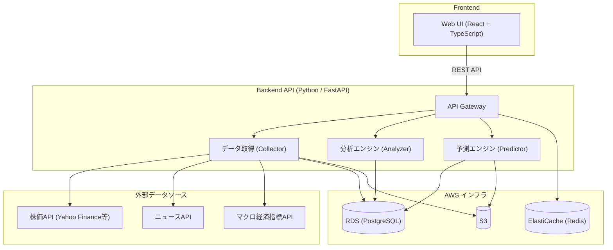

# 株式自動分析アプリ（Autonomous Stock Analyst）開発指示書

## 1. プロジェクト概要

本プロジェクトは、株式の将来価格を予測する自動分析アプリを構築する。
チャートのテクニカルトレンド分析と外部情報（ニュース、プレスリリース、一般市況指標）を組み合わせ、
対象銘柄の **1ヶ月〜12ヶ月先の株価予測** を算出する。

### 分析に用いるデータソース

| カテゴリ | データ例 |
|---|---|
| テクニカル指標 | 移動平均線（SMA/EMA）、RSI、MACD、ボリンジャーバンド、出来高 |
| ニュース | 企業関連ニュース、業界動向 |
| プレスリリース | 決算発表、IR情報、M&A情報 |
| 一般市況 | CPI（消費者物価指数）、政策金利、GDP、為替レート |

---

## 2. アーキテクチャ



---

## 3. 技術スタック

| レイヤー | 技術 |
|---|---|
| 言語（バックエンド） | Python 3.12+ |
| Web フレームワーク | FastAPI |
| データ処理 | pandas, numpy |
| ML/予測モデル | scikit-learn, Prophet, LightGBM（必要に応じて PyTorch） |
| テクニカル分析 | TA-Lib or pandas-ta |
| フロントエンド | React + TypeScript |
| インフラ | AWS（Terraform で IaC 管理） |
| CI/CD | GitHub Actions |
| コンテナ | Docker（Docker Compose によるローカル開発環境含む） |
| データベース | Amazon RDS (PostgreSQL) |
| キャッシュ | Amazon ElastiCache (Redis) |
| オブジェクトストレージ | Amazon S3 |

> **注意**: 技術選定は要件に応じて変更可能。変更する場合はこのドキュメントも更新すること。

---

## 4. ディレクトリ構成

```
autonomous-stock-analyst/
├── docs/                          # ドキュメント
│   └── instraction.md             # 本指示書
├── src/                           # アプリケーションコード
│   ├── backend/                   # バックエンド
│   │   ├── api/                   # API エンドポイント定義
│   │   ├── core/                  # 設定、共通ユーティリティ
│   │   ├── collectors/            # 外部データ取得モジュール
│   │   │   ├── stock_price.py     # 株価データ取得
│   │   │   ├── news.py            # ニュース取得
│   │   │   ├── macro.py           # マクロ経済指標取得
│   │   │   └── press_release.py   # プレスリリース取得
│   │   ├── analyzers/             # 分析モジュール
│   │   │   ├── technical.py       # テクニカル分析
│   │   │   └── sentiment.py       # センチメント分析
│   │   ├── predictors/            # 予測モジュール
│   │   │   └── price_predictor.py # 株価予測エンジン
│   │   ├── models/                # データモデル（Pydantic / SQLAlchemy）
│   │   ├── services/              # ビジネスロジック
│   │   └── tests/                 # テストコード
│   │       ├── unit/
│   │       ├── integration/
│   │       └── e2e/
│   └── frontend/                  # フロントエンド
│       ├── src/
│       │   ├── components/
│       │   ├── pages/
│       │   ├── hooks/
│       │   ├── services/
│       │   └── types/
│       └── tests/
├── infra/                         # インフラストラクチャ
│   ├── environments/              # 環境別設定
│   │   ├── dev/
│   │   ├── staging/
│   │   └── prod/
│   ├── modules/                   # Terraform モジュール
│   │   ├── networking/
│   │   ├── compute/
│   │   ├── database/
│   │   ├── storage/
│   │   └── monitoring/
│   ├── main.tf
│   ├── variables.tf
│   └── outputs.tf
├── .github/
│   └── workflows/                 # CI/CD パイプライン
│       ├── ci.yml                 # テスト・リント
│       ├── cd-staging.yml         # ステージングデプロイ
│       └── cd-prod.yml            # 本番デプロイ
├── docker-compose.yml
├── Dockerfile
└── README.md
```

---

## 5. 開発ルール

### 5.1 コーディング規約

- **Python**: PEP 8 に準拠。型ヒント（type hints）を必ず記述する
- **TypeScript**: ESLint + Prettier で統一フォーマット
- **命名規則**:
  - Python: `snake_case`（変数・関数）、`PascalCase`（クラス）
  - TypeScript: `camelCase`（変数・関数）、`PascalCase`（コンポーネント・型）
- **ドキュメント**: 公開関数・クラスには必ず docstring / JSDoc を記述する
- **環境変数**: シークレットや設定値はハードコードせず、環境変数または AWS Secrets Manager で管理する

### 5.2 Git ブランチ戦略

```
main          ← 本番リリース用（保護ブランチ）
├── develop   ← 開発統合ブランチ
│   ├── feature/xxx   ← 機能開発
│   ├── fix/xxx       ← バグ修正
│   └── refactor/xxx  ← リファクタリング
└── release/x.x.x    ← リリース準備
```

- コミットメッセージは [Conventional Commits](https://www.conventionalcommits.org/) に従う
  - 例: `feat: 株価データ取得モジュールを追加`、`fix: RSI計算の境界値エラーを修正`

### 5.3 コードレビュー

- `develop` および `main` への直接プッシュは禁止
- すべての変更は Pull Request 経由でマージする
- CI が全て通過していることをマージ条件とする

---

## 6. テスト方針

| テスト種別 | 対象 | ツール |
|---|---|---|
| ユニットテスト | 個々の関数・クラス | pytest |
| インテグレーションテスト | API エンドポイント、DB 連携 | pytest + httpx |
| E2E テスト | ユーザーフロー全体 | Playwright |
| 静的解析 | コード品質 | ruff, mypy |

- カバレッジ目標: **80% 以上**
- テストは CI パイプラインで自動実行する

---

## 7. インフラストラクチャ（AWS + Terraform）

### 7.1 AWS サービス構成

| サービス | 用途 |
|---|---|
| EC2 | 開発・検証環境でのアプリケーション実行 |
| ECS Fargate | 本番環境でのアプリケーション実行 |
| ALB | ロードバランシング |
| RDS (PostgreSQL) | メインデータベース |
| ElastiCache (Redis) | キャッシュ、セッション管理 |
| S3 | 静的ファイル、モデルアーティファクト保存 |
| CloudWatch | ログ・メトリクス監視 |
| Secrets Manager | シークレット管理 |
| Route 53 | DNS 管理 |
| ACM | SSL証明書管理 |

### 7.2 Terraform ルール

- **すべてのインフラはコード（Terraform）で管理する**。手動での AWS コンソール操作は禁止
- Terraform のステートファイルは **S3 + DynamoDB** でリモート管理する
- モジュール化を徹底し、再利用可能な構成にする
- `terraform plan` の結果を PR に自動コメントする

### 7.3 環境構成

| 環境 | コンピュート | 用途 |
|---|---|---|
| dev | EC2 | 開発者用。自由にデプロイ可。コスト最適化のため EC2 を使用 |
| staging | EC2 | リリース前の検証環境。本番相当の動作確認を行う |
| prod | ECS Fargate | 本番環境。CD パイプライン経由のみデプロイ可。スケーラビリティ重視 |

---

## 8. CI/CD パイプライン（GitHub Actions）

### 8.1 CI（継続的インテグレーション）

PR 作成・更新時に自動実行：

1. **Lint & Format チェック** — ruff, mypy, eslint, prettier
2. **ユニットテスト** — pytest
3. **インテグレーションテスト** — pytest + テスト用DB
4. **Terraform Plan** — `terraform plan` を実行し結果を PR にコメント
5. **Docker ビルドチェック** — イメージビルドが正常に完了することを確認

### 8.2 CD（継続的デリバリー）

- `develop` ブランチへのマージ → **staging** に自動デプロイ
- `main` ブランチへのマージ → **prod** に手動承認後デプロイ

---

## 9. 開発の優先順位

段階的に開発を進める。各フェーズで動作するものを作ることを最優先とする。

### Phase 1: 基盤構築
- [ ] プロジェクト初期セットアップ（Python + FastAPI）
- [ ] Terraform 基盤（VPC、ECS、RDS）
- [ ] CI パイプライン構築
- [ ] Docker 環境構築

### Phase 2: データ収集
- [ ] 株価データ取得モジュール（Yahoo Finance API 等）
- [ ] ニュース取得モジュール
- [ ] マクロ経済指標取得モジュール
- [ ] データ保存・管理機能

### Phase 3: 分析エンジン
- [ ] テクニカル指標算出モジュール
- [ ] ニュース・プレスリリースのセンチメント分析
- [ ] マクロ経済指標の影響分析

### Phase 4: 予測エンジン
- [ ] 株価予測モデルの構築・学習
- [ ] 1ヶ月〜12ヶ月先の価格予測 API
- [ ] 予測精度の評価・チューニング

### Phase 5: フロントエンド & 統合
- [ ] Web UI 構築
- [ ] 分析レポート表示画面
- [ ] 予測結果のチャート表示
- [ ] CD パイプライン構築（staging / prod）

---

## 10. セキュリティ要件

- API キー・シークレットはコードにハードコードしない
- すべての通信は HTTPS を使用する
- API には認証（JWT 等）を実装する
- IAM ロールは最小権限の原則に従う
- 依存パッケージの脆弱性スキャンを CI に組み込む

---

## 11. エージェントへの追加指示

- **各実装はテストと合わせて作成すること**。テストのないコードはマージしない
- **エラーハンドリング** を必ず実装し、想定外のデータに対しても安全に動作させる
- **ログ出力** を適切に設定し、デバッグ・運用時のトレーサビリティを確保する
- ファイルが長くなりすぎないよう **適切に分割** する（1ファイル 300行以内を目安）
- 外部 API 呼び出しには **リトライ処理** と **レートリミット対策** を入れる
- 既存コードとの一貫性を保つ。新しいパターンを導入する場合は理由をコメントに残す
